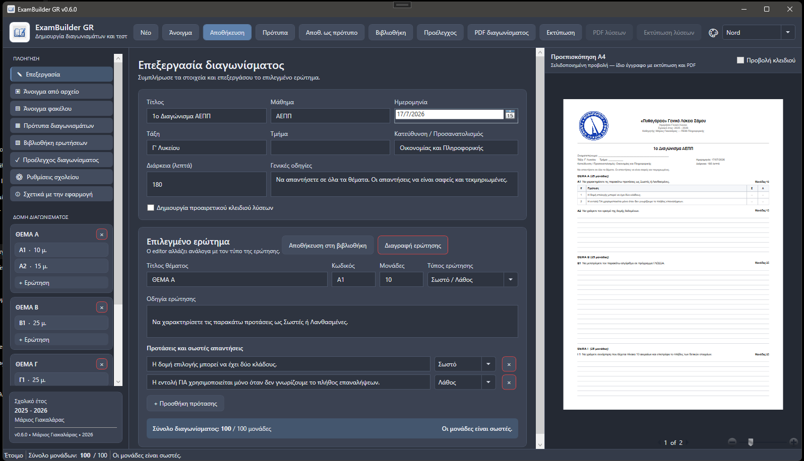

# ExamBuilder GR v1.0.0

Desktop εφαρμογή WPF/.NET 8 για δημιουργία, αποθήκευση, προεπισκόπηση και εκτύπωση διαγωνισμάτων, τεστ και κλειδιών λύσεων.

- **Δημιουργός:** Μάριος Γιακαλάρας
- **Έτος ανάπτυξης:** 2026
- **Έκδοση:** 1.0.0

## Σταθερή έκδοση 1.0.0

Η έκδοση 1.0.0 είναι η πρώτη σταθερή δημόσια έκδοση του ExamBuilder GR. Περιλαμβάνει τον ολοκληρωμένο editor διαγωνισμάτων, όλους τους υποστηριζόμενους τύπους ερωτήσεων, εικόνες και διαγράμματα, κλειδί λύσεων, πρότυπα, βιβλιοθήκη ερωτήσεων, προέλεγχο, ενσωματωμένη βοήθεια, portable πακέτο και Windows installer.

## Κεντρικές καρτέλες εργασίας

- Τα **Στοιχεία διαγωνίσματος** αποτελούν πλέον ξεχωριστή κεντρική καρτέλα.
- Η επιλογή δημιουργίας κλειδιού λύσεων βρίσκεται μόνο στις ρυθμίσεις του διαγωνίσματος.
- Η καρτέλα **Επεξεργασία** χωρίζεται καθαρά σε **Επεξεργασία ερωτήματος** και, όταν υπάρχει, **Επεξεργασία υποερωτήματος**.
- Η καρτέλα **Εικόνες** συγκεντρώνει χωριστά τις εικόνες του κεντρικού ερωτήματος και του επιλεγμένου υποερωτήματος.
- Ο editor υποερωτήματος διατηρεί τις καρτέλες **Περιεχόμενο** και **Ρυθμίσεις & λύση**, μαζί με σταθερό panel ιδιοτήτων.
- Η κάτω μπάρα μονάδων παραμένει ορατή σε όλο τον χώρο εργασίας.

## Βελτιωμένη πλοήγηση και ασφάλεια εργασίας

- Καθαρή επάνω γραμμή ενεργειών με ομαδοποιημένα μενού **Περιεχόμενο**, **Εξαγωγή** και **Περισσότερα**.
- Το αριστερό τμήμα χρησιμοποιείται αποκλειστικά για τη δομή θεμάτων και ερωτήσεων.
- Ρυθμιζόμενο πλάτος sidebar και προεπισκόπησης με διαχωριστικά.
- Συντομεύσεις `Ctrl+N`, `Ctrl+O` και `Ctrl+S`.
- Ένδειξη μη αποθηκευμένων αλλαγών και προειδοποίηση πριν από κλείσιμο ή αντικατάσταση του διαγωνίσματος.
- Άνοιγμα του κεντρικού φακέλου δεδομένων από την εφαρμογή.
- Δημιουργία πλήρους αντιγράφου ασφαλείας ZIP των αποθηκευμένων δεδομένων.

## Βασικές δυνατότητες

- Μόνιμα στοιχεία σχολείου και καθηγητή.
- Προαιρετικό λογότυπο σχολείου στην κεφαλίδα, με επιλογή θέσης, μεγέθους και ασπρόμαυρης εκτύπωσης.
- Επίσημο λογότυπο και εικονίδιο εφαρμογής ExamBuilder GR.
- Θέματα και ερωτήσεις με αυτόματο σύνολο μονάδων `/100`.
- Τύποι ερώτησης: Ανάπτυξης, Σωστό/Λάθος, Αντιστοίχισης, Συμπλήρωσης κενού και Πολλαπλής επιλογής.
- Κεντρική εκφώνηση ανά θέμα και υποερωτήματα Α1, Α2, Α3 με ξεχωριστές μονάδες και αυτόματο άθροισμα θέματος.
- Πολλές προτάσεις συμπλήρωσης κενού και πολλά κενά μέσα στην ίδια πρόταση.
- Ανεξάρτητο τυχαίο ανακάτεμα Στήλης Α και Στήλης Β, με σταθερή διάταξη σε preview/PDF/εκτύπωση.
- Αντιστοιχίσεις πολλά-προς-πολλά και προαιρετικές παραπλανητικές επιλογές.
- Γραμμές απάντησης, κενό πλαίσιο μεταβλητού ύψους ή καθόλου χώρος.
- Προαιρετικό κλειδί λύσεων με ξεχωριστή προεπισκόπηση, εκτύπωση και PDF.
- Σελιδοποιημένη προεπισκόπηση Α4.
- Themes Classic Light, Obsidian, Nord και Monokai.
- Αποθήκευση επεξεργάσιμων αρχείων `.exam.json`.


## Σύνθετες ερωτήσεις και υποερωτήματα

- Κάθε θέμα μπορεί να έχει προαιρετική **κεντρική εκφώνηση** και υποερωτήματα, π.χ. Α1, Α2, Α3.
- Οι μονάδες ορίζονται ξεχωριστά σε κάθε υποερώτημα και το σύνολο του θέματος υπολογίζεται αυτόματα.
- Στη συμπλήρωση κενού μπορείς να προσθέσεις πολλές προτάσεις και να δημιουργήσεις πολλά κενά στην ίδια πρόταση επιλέγοντας διαδοχικά λέξεις ή φράσεις.
- Στην αντιστοίχιση οι δύο στήλες καταχωρίζονται ανεξάρτητα και ανακατεύονται με σταθερό seed.
- Ένα στοιχείο της Στήλης Α μπορεί να αντιστοιχεί σε περισσότερα στοιχεία της Στήλης Β, και το ίδιο στοιχείο της Β μπορεί να χρησιμοποιείται σε περισσότερες σχέσεις.
- Το κλειδί λύσεων χρησιμοποιεί την τελική εμφανιζόμενη αρίθμηση/σήμανση μετά το ανακάτεμα.


## Εικόνες και διαγράμματα

Σε κάθε κεντρική εκφώνηση θέματος και σε κάθε υποερώτημα μπορούν να προστεθούν πολλές εικόνες ή διαγράμματα.

- Υποστηρίζονται PNG, JPG/JPEG, BMP και GIF.
- Επιλογή θέσης: πριν από την εκφώνηση, μετά την εκφώνηση ή στο τέλος.
- Στοίχιση αριστερά, κέντρο ή δεξιά.
- Ρυθμιζόμενο πλάτος από 2 έως 17,5 cm με αυτόματη διατήρηση αναλογιών.
- Προαιρετική λεζάντα και εμφάνιση στο κλειδί λύσεων.
- Διάταξη εικόνας μόνης της ή έως **τέσσερις εικόνες δίπλα στην ίδια σειρά**.
- Ομαδοποίηση σειράς, ώστε μόνο οι εικόνες με τον ίδιο αριθμό ομάδας να μπαίνουν δίπλα.
- Αυτόματη αρίθμηση ως **α), β), γ), δ)** ή **Εικόνα 1, Εικόνα 2…**.
- Οριζόντια gallery μικρογραφιών στον editor, χωρίς μεγάλη κάθετη λίστα.
- Οι εικόνες ενσωματώνονται στο αρχείο του διαγωνίσματος και μεταφέρονται μαζί του.

## Λογότυπο σχολείου

Από τις **Ρυθμίσεις σχολείου** μπορείς να επιλέξεις PNG, JPG, JPEG ή BMP. Η εφαρμογή:

- Αντιγράφει την εικόνα σε σταθερό φάκελο δεδομένων.
- Την εμφανίζει στην προεπισκόπηση Α4, στην εκτύπωση και στο PDF.
- Επιτρέπει θέση **Αριστερά** ή **Κέντρο**.
- Επιτρέπει πλάτος από 2,0 έως 4,0 cm.
- Υποστηρίζει προαιρετική ασπρόμαυρη απόδοση.
- Επιτρέπει προσωρινή απόκρυψη χωρίς να αλλάζουν τα υπόλοιπα στοιχεία σχολείου.

Το αποθηκευμένο αρχείο βρίσκεται εδώ:

```text
Έγγραφα\ExamBuilder GR\Στοιχεία εφαρμογής\school-logo.*
```

## Βιβλιοθήκη ερωτήσεων

Η επιλεγμένη ερώτηση μπορεί να αποθηκευτεί από τον editor στη βιβλιοθήκη και να επαναχρησιμοποιηθεί σε άλλο διαγώνισμα.

Η βιβλιοθήκη διαθέτει:

- Αναζήτηση σε εκφώνηση, μάθημα, τάξη και θέμα προέλευσης.
- Φίλτρα μαθήματος και τύπου ερώτησης.
- Προβολή μονάδων και βασικών πληροφοριών.
- Προσθήκη αντιγράφου της ερώτησης στο επιλεγμένο θέμα.
- Διαγραφή και άνοιγμα φακέλου αποθήκευσης.

Τα αρχεία αποθηκεύονται εδώ:

```text
Έγγραφα\ExamBuilder GR\Βιβλιοθήκη Ερωτήσεων
```

## Προέλεγχος εκτύπωσης

Πριν από εκτύπωση ή PDF η εφαρμογή ελέγχει:

- Σύνολο μονάδων `/100`.
- Κενές εκφωνήσεις ή μηδενικές μονάδες.
- Απαντήσεις Σωστού/Λάθους.
- Πληρότητα ζευγών αντιστοίχισης.
- Επιλεγμένη λέξη στη συμπλήρωση κενού.
- Μία και μόνο σωστή απάντηση στην πολλαπλή επιλογή.
- Ενδεικτικές απαντήσεις όταν ζητείται κλειδί λύσεων.

Τα σφάλματα εμποδίζουν την εκτύπωση, ενώ οι προειδοποιήσεις επιτρέπουν τη συνέχεια.

## Πρότυπα διαγωνισμάτων

- **Αποθ. ως πρότυπο**: αποθηκεύει το τρέχον διαγώνισμα ως επαναχρησιμοποιήσιμη βάση.
- **Πρότυπα**: εμφανίζει όλα τα πρότυπα με αναζήτηση και φίλτρο μαθήματος.
- **Χρήση προτύπου**: δημιουργεί νέο ανεξάρτητο διαγώνισμα με σημερινή ημερομηνία και νέο αναγνωριστικό.

Τα πρότυπα αποθηκεύονται εδώ:

```text
Έγγραφα\ExamBuilder GR\Πρότυπα
```

## Αποθήκευση διαγωνισμάτων

```text
Έγγραφα\ExamBuilder GR\Διαγωνίσματα\<σχολικό έτος>
```

## Ενσωματωμένη Βοήθεια

Η εφαρμογή διαθέτει πλήρη ενότητα **Βοήθεια και Οδηγός Χρήσης**, προσβάσιμη από την επάνω μπάρα, το μενού Περισσότερα ή με το πλήκτρο `F1`. Περιλαμβάνει:

- οδηγό δημιουργίας διαγωνίσματος σε 10 βήματα,
- αρχικές ρυθμίσεις σχολείου και λογοτύπου,
- θέματα, υποερωτήματα και μονάδες,
- όλους τους τύπους ερωτήσεων,
- εικόνες και διαγράμματα,
- κλειδί λύσεων, προέλεγχο, PDF και εκτύπωση,
- πρότυπα, βιβλιοθήκη, backup, συντομεύσεις και FAQ.


## Εκτέλεση

1. Άνοιξε το `ExamBuilderGR.sln` με Visual Studio 2022.
2. Βεβαιώσου ότι είναι εγκατεστημένα το workload **.NET desktop development** και το .NET 8 SDK.
3. Επίλεξε `Build → Rebuild Solution`.
4. Πάτησε `F5`.

## PDF

Η εξαγωγή γίνεται μέσω του εκτυπωτή **Microsoft Print to PDF** των Windows.

## Στιγμιότυπο εφαρμογής



## Δημιουργία εκτελέσιμου

Το repository περιλαμβάνει έτοιμα scripts για δύο εκδόσεις Windows x64:

- **Portable self-contained**: φάκελος με το EXE και όλα τα απαραίτητα αρχεία.
- **Single-file self-contained**: ένα κύριο EXE, συσκευασμένο σε ZIP.

```powershell
powershell -ExecutionPolicy Bypass -File .\scripts\publish-release.ps1
```

Τα αρχεία δημιουργούνται στον φάκελο `dist` μαζί με SHA-256 checksums.

## Δημιουργία installer

Το project περιλαμβάνει έτοιμα αρχεία Inno Setup:

```powershell
winget install --id JRSoftware.InnoSetup.7 -e -s winget -i
powershell -ExecutionPolicy Bypass -File .\scripts\build-installer.ps1
```

Το αποτέλεσμα δημιουργείται στον φάκελο:

```text
dist\installer\ExamBuilderGR_Setup_v1.0.0.exe
```

Για δημιουργία και ανέβασμα στο υπάρχον GitHub Release:

```powershell
powershell -ExecutionPolicy Bypass -File .\scripts\build-installer.ps1 -UploadToGitHub
```

Αναλυτικές οδηγίες: [`docs/INSTALLER_GUIDE.md`](docs/INSTALLER_GUIDE.md)

## GitHub Actions

- Το `build.yml` ελέγχει αυτόματα κάθε push και pull request.
- Το `release.yml` δημιουργεί Windows πακέτα όταν γίνει push tag της μορφής `v*`.
- Tags που περιέχουν `rc`, `beta`, `alpha` ή `preview` δημοσιεύονται ως prerelease.

Αναλυτικές οδηγίες: [`docs/GITHUB_RELEASE_GUIDE.md`](docs/GITHUB_RELEASE_GUIDE.md)

## Άδεια χρήσης

Δεν έχει επιλεγεί ακόμη άδεια ανοικτού κώδικα. Μέχρι να προστεθεί ρητή άδεια,
ισχύουν τα συνήθη δικαιώματα πνευματικής ιδιοκτησίας του δημιουργού.
